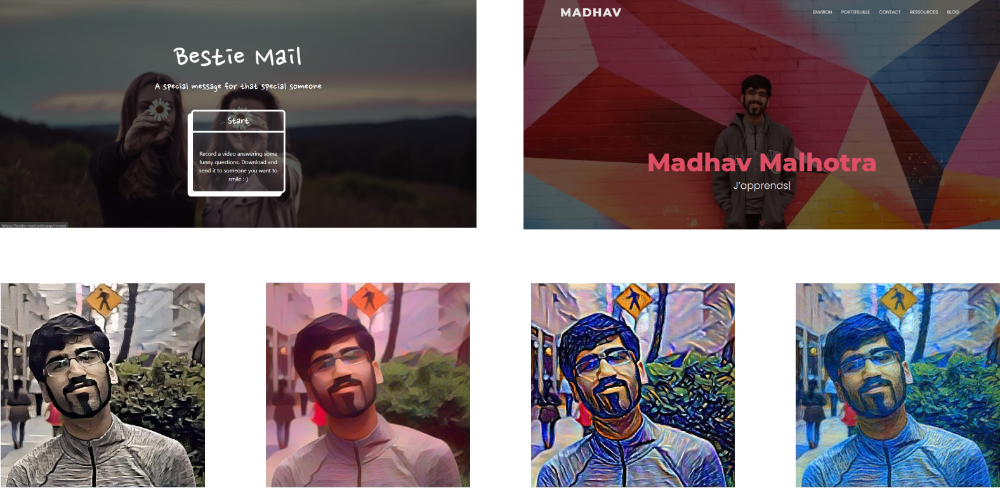

# Greetings, my dear fellow 🖐️
You already know who it is... (no really, my name is at the top right :-) But here are some other helpful details:
- I’m a 18-year-old from Toronto, Canada. 
- I love the planet, my mother, and my best friend! 💖
- **I value helpfulness, reliability, and resourcefulness (in that order).** 
- **I’m looking for ways to balance economic and environmental sustainability.** 🌎👔

# About the whole code thing... 👉👈
I’ll be honest - I’m not a great developer. 

Don’t get me wrong - one of my core values is resourcefulness, so **there’s very little I can’t learn within 3 days and 10 Stack Overflow posts** 😸
But I don’t code for the sake of coding. It’s a tool for me - like a screwdriver. 
- I don’t think: “YEAH, I LOVE TURNING THIS SCREWDRIVER!!!” 😜
- I think: “Wow, look at this cool project I can build with a screwdriver!” 

These days, **I’m working on websites, single page applications, cross-platform apps, and AI algorithms.** Here are some recent projects:
- [Bestie Mail](https://github.com/Madhav-Malhotra/bestie-mail): I made this site with React to send a funny, cute message to your special someone. 
- [Personal Website](https://github.com/Madhav-Malhotra/Madhav-Malhotra.github.io): Site made with vanilla HTML/CSS/JS and Notion Sites. Showcases my portfolio, blog, and some hidden goodies 😉
- [Sprint Timer](https://github.com/Madhav-Malhotra/sprint-timer-app): My first app, made with React Native. It’s meant to be simple - set a time, set a goal, and work. 
- [Neural Style Transfer](https://github.com/Madhav-Malhotra/neural-style-transfer): I learned about neural style transfer in Andrew Ng’s CNN course. I then used it to make my best friend a photo gallery because she loves nostalgic photos 🤗

# Catch me if you can... 

Here are some links to help 😋
- 🌐  Website: https://madhavmalhotra.com/ 
- 👔  Linkedin: https://linkedin.com/in/madhav-malhotra/
- 💬  Twitter: https://twitter.com/madhavmalhotra/
