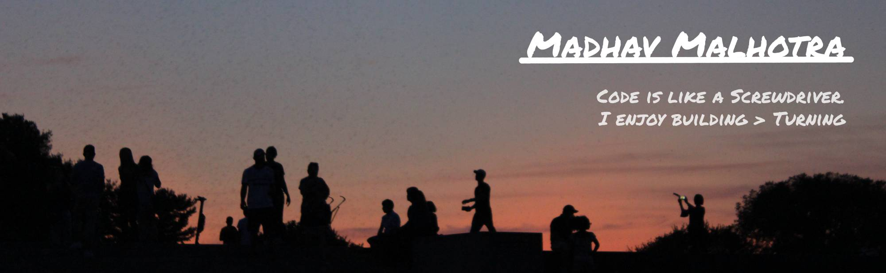

# Greetings, my dear fellow 🖐️
Happy to have you join me on this little page I call ~my propaganda centre~ home! Here are some unsollicited factoids about me :D
- **I value helpfulness, reliability, and resourcefulness (in that order).** 
- I’m looking for ways to solve neglected global problems. 🌎👔
- I’m a computer engineering student at the University of Waterloo.

# My journey with computers 🚀
Computers seem like my secret weapon to get around all of my human limitations. I can schedule tasks to be done ahead of time, multitask, serve everyone at once... all things that someone who values helpfulness would love! Plus, one of my core values is resourcefulness, so **there’s very little I can’t learn within 3 days and 10 Stack Overflow posts.**

These days, **I’m working on bio-inspired AI algorithms, full-stack development, and obsessively-detailed documentation.** 😸 Here are some recent projects:
- [Canadian Institute of Cybersecurity IoT Dataset](https://github.com/Madhav-Malhotra/cicIoT): I've been experimenting with bio-inspired algorithms like the genetic algorithm, grey wolf optimiser, and artificial immune system. The aim is to use these to classify cyberattacks on smart devices like security cameras.
- [ML Parameter Encryption](https://github.com/Madhav-Malhotra/ML-parameter-encryption): I implemented some algorithms from research papers trying to prevent the theft of AI models.
- [Multi-search dropdowns](https://github.com/Madhav-Malhotra/multi-search-dropdowns): At an internship at Public Health Canada, I went full-out on code reusability, documentation, and OOP to make Javascript dropdown components that met accessibility standards and enabled multiselect and/or search capabilities.
- [Eve Explorer](https://github.com/Madhav-Malhotra/Eve-Robot-Explorer): I used Autodesk's Fusion 360 to model Eve from Wall-E! Being a Wall-E fan, I also _had_ to make a [Blender animation](https://www.linkedin.com/posts/madhav-malhotra_my-first-3d-animation-i-feel-happy-because-activity-6892600844219416576-ebre/?utm_source=share&utm_medium=member_desktop) and [Three.js simulator](https://www.madhavmalhotra.com/Eve-Robot-Explorer/dist/index.html) 😁

# Catch me if you can... 

Here are some links to help 😋
- 🌐  Website: [madhavmalhotra.com/](https://madhavmalhotra.com/) 
- 👔  Linkedin: [linkedin.com/in/madhav-malhotra/](https://linkedin.com/in/madhav-malhotra/)
